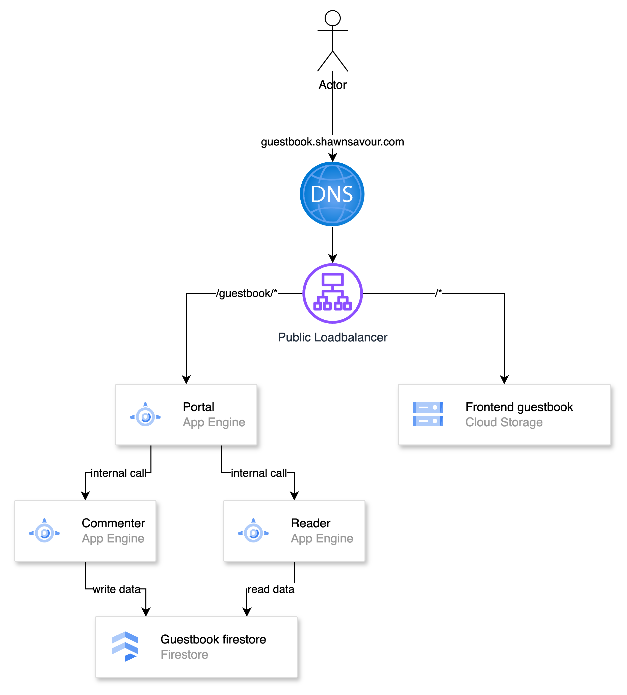

# GUESTBOOK MICROSERVICE TEST FOR APP ENGINE

# Architecture
The architecture of the guestbook microservice is as follows:
- GCS bucket for storing guestbook frontend
- App Engine for hosting the guestbook microservice
- Portal microservice for handling the public API requests
- Commenter and reader microservices for handling the internal API requests from the portal microservice
- Firestore for storing the comments

<!-- refer architeture.png -->
# Architecture Diagram

